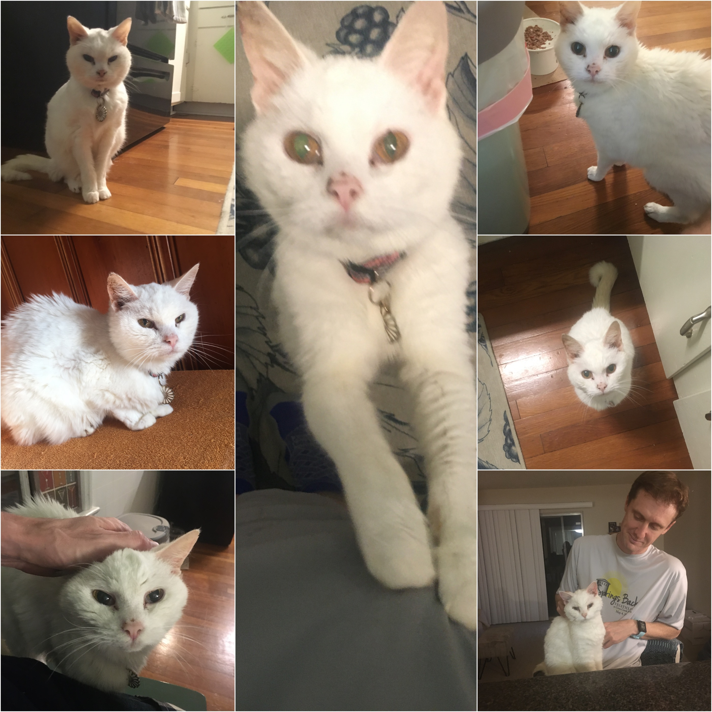
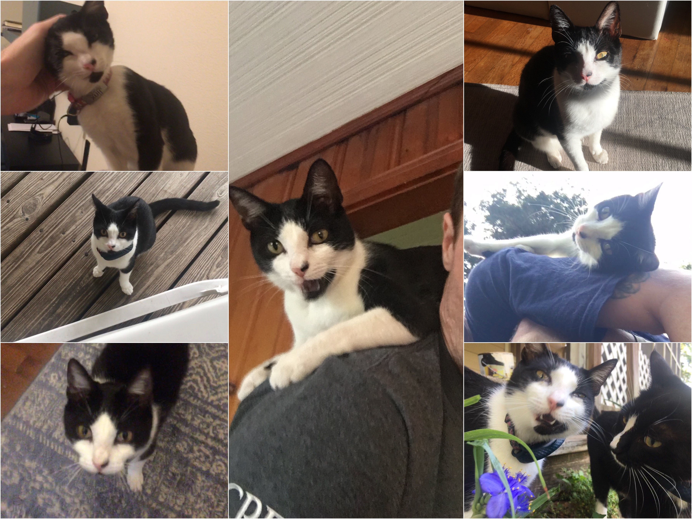
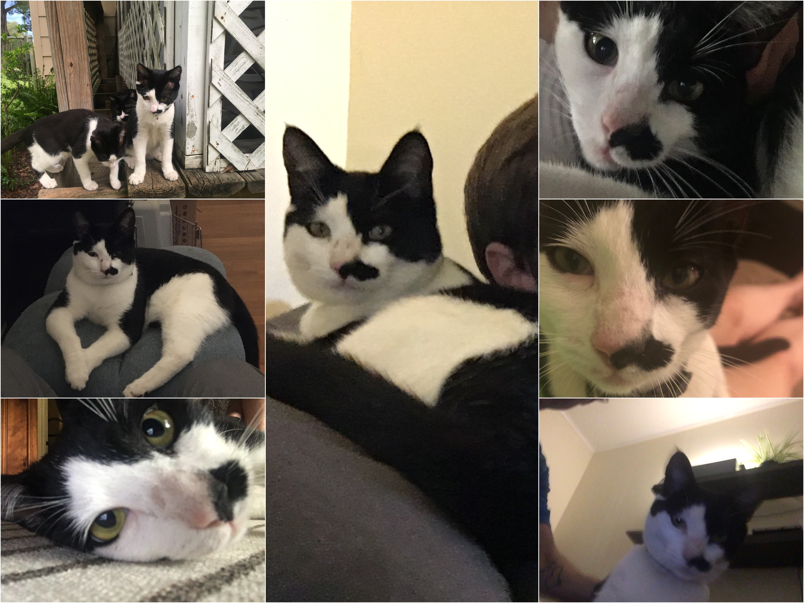
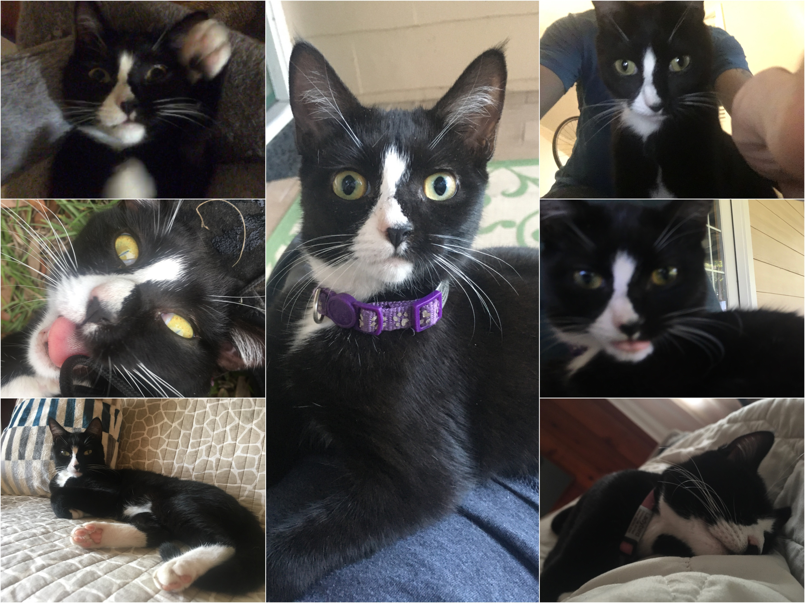
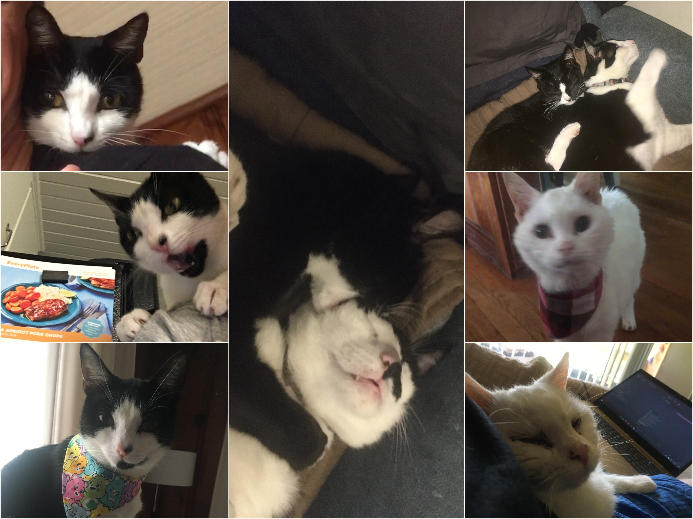

```{r setup, include=FALSE}
knitr::opts_chunk$set(echo = FALSE)
```


<section>
  <h2>Yuki</h2>
  
  <p>This is Yuki. My partner of the time had her, a rescue of a rescue, for about a year before I came home, and she was already very senior. She was a very cranky and particular girl, but, still, she accepted me and welcomed me home immediately. We both miss her very much.</p>
</section>

<section>
  <h2>Jinx</h2>
  
  <p>This is Jinx! I wish I never taught her to climb me -- now she wants to do it alllll the time! </p>
</section>

<section>
  <h2>Bruiser</h2>
  
  <p>Bruiser was a big sweet silly goof -- I miss him so much.</p>
</section>

<section>
  <h2>Ladybird</h2>
  
  <p>And this is Ladybird, who, if you ask her, is an only child, at least out in public. She's the most precious and delicate little sweetheart, as long as she's not hunting lizards!</p>
</section>

<section>
  <h2>Everyone</h2>
  
  <p>Here are more pictures of those same cats! You're welcome!</p>
</section>